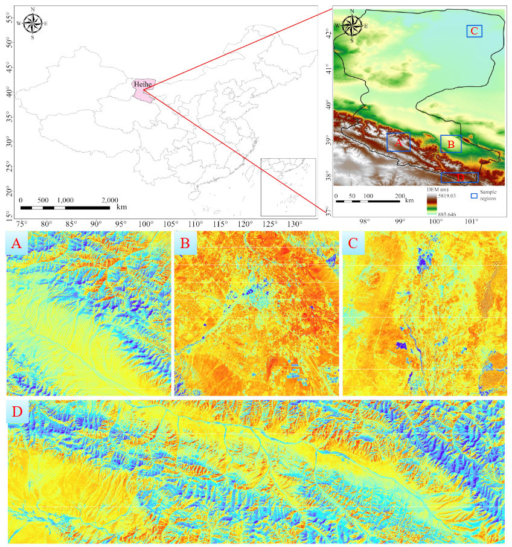
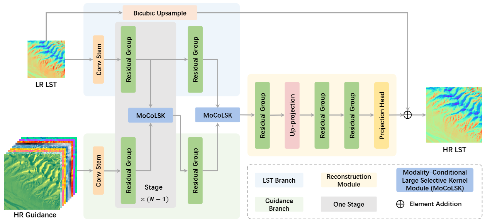
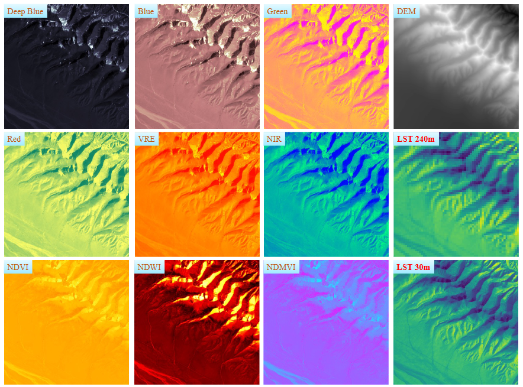

# 🔥🔥 GrokLST: Towards High-Resolution Benchmark and Toolkit for Land Surface Temperature Downscaling  🔥🔥

Qun Dai, Chunyang Yuan, Yimian Dai, Yuxuan Li, Xiang Li, Kang Ni, Jianhui Xu, Xiangbo Shu, Jian Yang

This repository is the official site for "GrokLST: Towards High-Resolution Benchmark and Toolkit for Land Surface Temperature Downscaling".


## Abstract

Land Surface Temperature (LST) is a critical parameter for environmental studies, but obtaining high-resolution LST data remains challenging due to the spatio-temporal trade-off in satellite remote sensing.
Guided LST downscaling has emerged as a solution, but current methods often neglect spatial non-stationarity and lack a open-source ecosystem for deep learning methods. 
To address these limitations, we propose the Modality-Conditional Large Selective Kernel (MoCoLSK) Networks, a novel architecture that dynamically fuses multi-modal data through modality-conditioned projections. MoCoLSK re-engineers our previous LSKNet to achieve a confluence of dynamic receptive field adjustment and multi-modal feature integration, leading to enhanced LST prediction accuracy. 
Furthermore, we establish the GrokLST project, a comprehensive open-source ecosystem featuring the GrokLST dataset, a high-resolution benchmark, and the GrokLST toolkit, an open-source PyTorch-based toolkit encapsulating MoCoLSK alongside 40+ state-of-the-art approaches.
Extensive experimental results validate MoCoLSK's effectiveness in capturing complex dependencies and subtle variations within multispectral data, outperforming existing methods in LST downscaling.
Our code, dataset, and toolkit are available at https://github.com/GrokCV/GrokLST.

<!-- # todo 放个数据集图像 -->
<!--  -->



## Introduction

**DATASET DOWNLOAD at:**


* Baidu Disk: [GrokLST dataset](https://pan.baidu.com/s/1-X2PHUBpFiq6JhtUWAUXLw?pwd=Grok)



# MoCoLSK: Modality-Conditional Large Selective Kernel Module


# GrokLST Toolkit

- [Abstract](#abstract)
- [Introduction](#introduction)
- [Installation](#installation)
  - [Step 1: Create a conda environment](#step-1-create-a-conda-environment)
  - [Step 2: Install PyTorch](#step-2-install-pytorch)
  - [Step 3: Install OpenMMLab 2.x Codebases](#step-3-install-openmmlab-2x-codebases)
  - [Step 4: Install `groklst`](#step-4-install-groklst)
- [⭐文件夹介绍](#文件夹介绍)
  - [configs 文件夹](#configs-文件夹)
  - [data 文件夹](#data-文件夹)
  - [groklst 文件夹 (核心代码)](#groklst-文件夹-核心代码)
  - [tools 文件夹](#tools-文件夹)
- [🚀训练](#训练)
  - [单卡训练](#单卡训练)
  - [多卡训练](#多卡训练)
- [🚀测试](#测试)
  - [单卡测试](#单卡测试)
  - [多卡测试](#多卡测试)
- [Model Zoo and Benchmark](#model-zoo-and-benchmark)
  - [Leaderboard](#leaderboard)
  - [Model Zoo](#model-zoo)
    - [Method A](#method-a)
    - [Method B](#method-b)
- [BUG LOG](#bug-log)
- [Get Started](#get-started)
- [Acknowledgement](#acknowledgement)
- [Citation](#citation)
- [License](#license)


## Installation

### Step 1: Create a conda environment

```shell
conda create --name groklst python=3.9 -y
source activate groklst
```

### Step 2: Install PyTorch

```shell
# CUDA 12.1
conda install pytorch==2.1.2 torchvision==0.16.2 torchaudio==2.1.2 pytorch-cuda=12.1 -c pytorch -c nvidia -y
```

### Step 3: Install OpenMMLab 2.x Codebases

```shell
# openmmlab codebases
pip install -U openmim dadaptation chardet --no-input
# mim install mmengine "mmcv==2.1.0" "mmdet>=3.0.0" "mmpretrain>=1.0.0rc7"
mim install mmengine "mmcv==2.1.0" "mmdet>=3.0.0" "mmsegmentation>=1.0.0" "mmpretrain>=1.0.0rc7" 'mmagic'
# other dependencies
pip install -U ninja scikit-image --no-input
pip install kornia==0.6.5 # 0.7.1
pip install albumentations==1.3.1
pip install diffusers==0.24.0
```

### Step 4: Install `groklst`

```shell
python setup.py develop
```

**Note**: make sure you have `cd` to the root directory of `GrokLST`

```shell
git clone git@github.com:GrokCV/GrokLST.git
cd GrokLST
```


## ⭐文件夹介绍

- GrokLST toolkit 整体文件夹介绍

```shell
GrokLST  
    ├── configs  (配置文件夹)
    ├── data (存放数据集)   
    ├── groklst (核心代码)   
    ├── requirements (环境依赖)   
    ├── tools (训练测试工具)  
    ├── work_dirs (存放模型及日志文件等) 
```


### configs 文件夹

- 结构及作用

```shell
configs
    ├── _base_  
    │   ├── datasets (数据集配置以及 train、val、test 的 pipeline、dataloader 和 evaluator等)  
    │   │    ├── black_river_lst_x2-256-512_sisr.py (SISR 配置，不包括引导数据，只含有 LST)  
    │   │    ├── black_river_lst_x2-256-512.py (GDSR 配置，包括 LST 和引导数据)  
    │   │    ├── ...
    │   ├── schedules (迭代次数及优化器等配置)  
    │   ├── default_runtime.py  
    ├── ahmf (模型配置文件)  
    │   ├── ahmf_x2_4xb1-10k_lst.py  
    │   ├── ahmf_x4_4xb1-10k_lst.py  
    │   ├── ahmf_x8_4xb1-10k_lst.py  
    ├── ...  
    ├── mocolsk(Ours)  
    │   ├── mocolsk_x2_4xb1-10k_lst.py  
    │   ├── mocolsk_x4_4xb1-10k_lst.py  
    │   ├── mocolsk_x8_4xb1-10k_lst.py  
    ├── ...  
    ├── sisr (单图超分模型配置文件夹)  
    │   ├── act  
    │   │    ├── act_x2_4xb1-10k_lst.py  
    │   │    ├── act_x4_4xb1-10k_lst.py  
    │   │    ├── act_x8_4xb1-10k_lst.py  
    │   ├── ...  
    │   ├── ...  
    │   ├── swinir (模型配置文件)  
    ├── suft (模型配置文件)  
    ├── svlrm (模型配置文件)  
```


### data 文件夹

1. 以 black_river_lst 数据集为例来介绍其存放结构

```shell
data
    ├──black_river_lst (每个文件夹下有641个mat文件)  
            ├── 30m  
            │   ├── guidance (引导信息)  
            │   ├── lst (LST数据)  
            ├── 60m  
            │   ├── guidance  
            │   ├── lst  
            ├── 120m  
            │   ├── guidance  
            │   ├── lst  
            ├── 240m  
            │   ├── guidance  
            │   ├── lst  
            ├── split (train:val:test=6:1:3)  
            │   ├── train.txt  
            │   ├── val.txt  
            │   ├── trainval.txt (tarin+val)  
            │   ├── test.txt  
            ├── README_BRLST.md  
```
2. 以 black_river_lst/30m 为例, 来说明该数据集：
- guidance 文件夹：是将 10 种辅助引导波段信息按通道进行拼接后的文件数据，10 种引导信息拼接顺序为"dem", "deepblue", "blue", "green", "red", "vre", "nir", "ndmvi", "ndvi", "ndwi";

- lst 文件夹：是 LST（Land Surface Temperature）数据，其中 "30m" 分辨率的 LST 数据可当做 GT，其他分辨率的 LST 数据都是需要超分的低分辨率数据；

- split 文件夹：是数据集的划分策略，train:val:test=6:1:3，trainval:test=7:3;

3. black_river_lst 详情见下表： 

| 分辨率 | scale | crop size | crop step | h/w | guidance.shape (h,w,c) |
| ------ | ----- | --------- | --------- | --- | ---------------------- |
| 30m    | -     | 512       | 256       | 512 | 512x512x10             |
| 60m    | x2    | 256       | 128       | 256 | 256x256x10             |
| 120m   | x4    | 128       | 64        | 128 | 128x128x10             |
| 240m   | x8    | 64        | 32        | 64  | 64x64x10               |


### groklst 文件夹 (核心代码)

- 结构

```shell
groklst
    ├── datasets  
    │   ├── transforms (数据处理的 pipeline)  
    │   │    ├── dropping_bands.py  (随机丢弃波段)  
    │   │    ├── formatting_data.py (打包数据)  
    │   │    ├── loading_data.py  (加载数据)  
    │   │    ├── normalizing_data.py (归一化引导数据)  
    │   ├── basic_lst_dataset.py (black_river_lst 数据集类)  
    ├── evaluation  
    │   │    ├── metrics  (各种衡量指标)  
    ├── models    
    │   ├── data_preprocessors  
    │   │    ├── data_preprocessor.py  (数据预处理器)    
    │   ├── editors (所有模型在此！！！)  
    │   │    ├── act   
    │   │    ├── ...  
    │   │    ├── mocolsk (Ours)  
    │   │    ├── ...  
    │   │    ├── swinir  
    │   ├── losses   
    │   │    ├── loss_wrapper.py  
    │   │    ├── pixelwise_loss.py (自定义的 SmoothL1Loss)   
    ├── visualization   
    │   ├── custom_concat_visualizer.py  (自定义的可视化器)  
    │   ├── vis_backend.py  
    │   ├── visualizer.py  
```


### tools 文件夹

- 结构如下

```shell
tools  (训练测试入口！！！)
    ├── dist_test.sh (分布式测试脚本)  
    ├── dist_train.sh (分布式训练脚本)    
    ├── test.py (单卡测试脚本)  
    ├── train_det.py (目前未开发，不可用)  
    ├── train_rotate.py (目前未开发，不可用)  
    ├── trian_seg.py  (目前未开发，不可用)  
    ├── train.py (单卡训练脚本)  
```


## 🚀训练

### 单卡训练

- 单卡训练命令 (默认使用 GPU0 )：

```shell
python tools/train.py ${CONFIG_FILE}

# 以 MoCoLSK-Net为例
python tools/train.py configs/gisr/mocolsk/mocolsk_x8_4xb1-10k_lst.py
```


### 多卡训练

- 多卡训练命令 (假设是四卡机)：

```shell
# export CUDA_VISIBLE_DEVICES=0,1,2,3 
PORT=29500 tools/dist_train.sh ${CONFIG_FILE} 4

# 以 MoCoLSK-Net为例
PORT=29500 tools/dist_train.sh configs/gisr/mocolsk/mocolsk_x8_4xb1-10k_lst.py 4
```


## 🚀测试

### 单卡测试

- 单卡测试命令 (默认使用 GPU0 )：

```shell
python tools/test.py ${CONFIG_FILE} ${CHECKPOINT_FILE}

# 以 MoCoLSK-Net 为例：
python tools/test.py configs/gisr/mocolsk/mocolsk_x8_4xb1-10k_lst.py your/model/path.pth
```


### 多卡测试

- 多卡测试命令 (假设是四卡机)：

```shell
# export CUDA_VISIBLE_DEVICES=0,1,2,3 
tools/dist_test.sh ${CONFIG_FILE} ${CHECKPOINT_FILE} 4

# 以 MoCoLSK-Net为例：
PORT=29500 tools/dist_test.sh configs/gisr/mocolsk/mocolsk_x8_4xb1-10k_lst.py your/model/path.pth 4
```


## Model Zoo and Benchmark

**Note: Both passwords for BaiduYun and OneDrive is `grok`**.

### Leaderboard

### Model Zoo

#### Method A

<table>
    <tr>
        <td>Model</td>
        <td>mAP</td>
        <td>#Params</td>
        <td>FLOPs</td>
        <td>Config</td>
        <td>Training Log</td>
        <td>Checkpoint</td>
        <td>Visualization</td>
    <tr>
    <tr>
        <td></td>
        <td></td>
        <td></td>
        <td></td>
        <td colspan="4">
            <a href=""> 百度网盘 </a> | <a href=""> OneDirve </a>
        </td>
    <tr>
</table>

#### Method B

<table>
    <tr>
        <td>Model</td>
        <td>mAP</td>
        <td>#Params</td>
        <td>FLOPs</td>
        <td>Config</td>
        <td>Training Log</td>
        <td>Checkpoint</td>
        <td>Visualization</td>
    <tr>
    <tr>
        <td></td>
        <td></td>
        <td></td>
        <td></td>
        <td colspan="4">
            <a href=""> 百度网盘 </a> | <a href=""> OneDirve </a>
        </td>
    <tr>
</table>


## BUG LOG
运行 dist_test.sh / test_mmagic.py 的时候，会遇到以下问题：
```shell
"The model and loaded state dict do not match exactly

unexpected key in source state_dict: generator.module.conv1.weight, generator.module.conv1.bias, generator.module.conv2.weight, generator.module.conv2.bias, generator.module.conv3.weight, generator.module.conv3.bias

missing keys in source state_dict: generator.conv1.weight, generator.conv1.bias, generator.conv2.weight, generator.conv2.bias, generator.conv3.weight, generator.conv3.bias"
```

问题分析：
- 首先，你会怀疑网络模型和保存的 checkpoint 中的 state_dict 不匹配，其实并不是的；
- 这主要是因为 mmengine.runner.chechpoint.py 中的 函数 "_load_checkpoint_to_model" (大概585行) 的参数revise_keys=[(r'^module//.', '')]:有问题；
- '^module//.' 是 re 中的一种模式，想将类似 "generator.module.conv1.weight" 改为 "generator.conv1.weight" ，即去掉 "generator.module.conv1.weight" 中的 "module."；
- 但是，由于 "generator.module.conv1.weight" 并不是以 "module." 开头，即不匹配模式 '^module//.'；

解决方法：
- mmengine.runner.runner.py 中类 Runner 的函数 load_checkpoint 中的参数 "revise_keys=[(r'^module//.', '')]):" (大概2111行) 替换为 "revise_keys=[(r'/bmodule.', '')]):"，实现将类似 "generator.module.conv1.weight" 改为 "generator.conv1.weight" ，即去掉 "generator.module.conv1.weight" 中的 "module."!

## Get Started

Please see [get_started.md](https://github.com/open-mmlab/mmagic/blob/main/docs/en/get_started/overview.md) for the basic usage of GrokLST toolkit.


## Acknowledgement


## Citation

If you use this toolbox or benchmark in your research, please cite this project.

```bibtex
@article{dai2024GrokLST,
	title={GrokLST: Towards High-Resolution Benchmark and Toolkit for Land Surface Temperature Downscaling}, 
	author={Dai, Qun and Yuan, Chunyang and Dai, Yimian and Li, Yuxuan and Li, Xiang and Ni, Kang and Xu, Jianhui and Shu, Xiangbo and Yang, Jian},
	year={2024},
	journal={arXiv},
}
```

## License

This project is released under the [Attribution-NonCommercial 4.0 International](LICENSE).
>>>>>>> 5e20848 (Initial commit)
